# ⚽ World Football Insights (WFI) : Cloud-Native Serverless ELT on GCP


A production-shipped **cloud-native serverless ELT pipeline** built on Google Cloud Platform for a global sports analytics scenario. Cloud Composer orchestrates 14 tasks with parallel fan-out and quality gates. Dataproc Serverless runs PySpark medallion transformations without any cluster management. Bronze raw data stays in a GCS lakehouse; Silver and Gold materialize as BigQuery external tables. Async aiohttp extraction from TheSportsDB API. Explicit BigQuery schemas replace autodetect. **Real production deployment: managed infrastructure, real cost, real runtime data.**

---

## 📖 TL;DR

> ⚽ **World Football Insights (WFI)**: a global sports analytics company modernizing its data operations. This pipeline replaces manual CSV downloads and spreadsheet consolidation with a fully automated cloud-native ELT platform that lands raw JSON in GCS, transforms through PySpark medallion layers via Dataproc Serverless, and materializes analytics-ready tables in BigQuery.
>
> **Stack:** Cloud Composer 2 (Airflow 2.11.1), Dataproc Serverless 2.1, Google Cloud Storage, BigQuery, Python 3.11, PySpark, aiohttp, pandas + pyarrow.
>
> **Runtime:** 11m 53s optimized end-to-end, 24m 53s with production-grade explicit schemas. 84% runtime cut from initial deployment after debugging a Dataproc machine-type provisioning issue.

---

## 🏗️ Architecture: Cloud-Native Serverless Lakehouse Medallion

```mermaid
graph LR
    A[TheSportsDB<br/>REST API] -->|async aiohttp<br/>+ backoff| B[Cloud Composer<br/>Airflow 2.11.1<br/>extract task]
    B -->|NDJSON upload<br/>via GCSHook| C[(GCS Bronze<br/>raw NDJSON)]
    C -->|3 parallel<br/>GCS sensors| D[Dataproc Serverless<br/>bronze_to_silver.py<br/>PySpark 2.1]
    D -->|partitioned<br/>Parquet + snappy| E[(GCS Silver<br/>Parquet)]
    E -->|validate_silver_data<br/>Python quality gate| F[3 parallel loads<br/>to BigQuery<br/>silver_* tables]
    F --> G[Dataproc Serverless<br/>silver_to_gold.py<br/>PySpark 2.1]
    G -->|curated<br/>Parquet + snappy| H[(GCS Gold<br/>Parquet)]
    H -->|3 parallel loads<br/>to BigQuery<br/>gold_* tables| I[(BigQuery Gold<br/>gold_teams<br/>gold_standings<br/>gold_matches)]

    style A fill:#f9f9f9,stroke:#333,stroke-width:2px
    style B fill:#e3f2fd,stroke:#1976d2,stroke-width:2px
    style C fill:#fff3e0,stroke:#f57c00,stroke-width:2px
    style D fill:#e8f5e9,stroke:#388e3c,stroke-width:2px
    style E fill:#fff3e0,stroke:#f57c00,stroke-width:2px
    style F fill:#e3f2fd,stroke:#1976d2,stroke-width:2px
    style G fill:#e8f5e9,stroke:#388e3c,stroke-width:2px
    style H fill:#fff3e0,stroke:#f57c00,stroke-width:2px
    style I fill:#f3e5f5,stroke:#7b1fa2,stroke-width:2px
```



### Stack Overview

| Layer | Technology | Purpose |
|---|---|---|
| **Orchestration** | Cloud Composer 2 (Airflow 2.11.1) | Managed Apache Airflow on GKE, hosts the 14-task DAG |
| **Compute** | Dataproc Serverless 2.1 | Ephemeral PySpark batches, zero clusters managed by hand |
| **Storage (Lake)** | Google Cloud Storage | Bronze NDJSON + Silver/Gold Parquet with snappy compression |
| **Warehouse** | Google BigQuery | Silver + Gold as external tables with explicit schemas |
| **Extraction** | Python 3.11 + aiohttp + asyncio | Async concurrent API fetch with rate-limit handling |
| **Validation** | pandas + pyarrow | Row count + required column checks between Silver and Gold |
| **Language** | Python 3.11, PySpark 3.x | Extract, transform, orchestrate |
| **Format** | NDJSON + Parquet (snappy) | Raw and columnar storage across layers |

**Zero clusters managed by hand. Zero servers. Zero infrastructure to maintain.**

---

## 📊 Business Impact

- **Decision Speed:** analysts stop consolidating CSVs by hand; Gold tables are queryable in BigQuery the moment the pipeline completes.
- **Reliability:** explicit `SchemaField` declarations replace `autodetect=True` on every load, so BigQuery never guesses column types on production data.
- **Auditability:** raw NDJSON stays in GCS Bronze as the immutable single source of truth; any Silver or Gold row can be traced back to the exact API payload.
- **Cost Discipline:** Dataproc Serverless spins compute up per batch and down to zero when idle; BigQuery external tables avoid duplicated storage.

---

## 🎯 Real Runtime Data

Three real captured runs on Cloud Composer, in the order they were made:

| Run | Duration | Config change |
|---|---|---|
| Run 1: initial deployment | **1h 13m 25s** | Dataproc Serverless auto-selecting `e4-custom-4-15872`, unavailable in `us-central1-a`. Machine provisioning failed and fell back to slower defaults with retries. |
| Run 2: after `execution_config: {}` fix | **11m 53s** | Added empty `execution_config: {}` to both Dataproc batches. Dataproc used zone-appropriate defaults instead of bleeding-edge families. **84% runtime reduction from a two-line config change.** |
| Run 3: after explicit BigQuery schemas | **24m 53s** | Replaced `autodetect=True` with `schema_fields=...` on all six load tasks. BigQuery now validates every Parquet field against the declared schema. Explicit schemas trade runtime for correctness. |

### Cost per run

Roughly **£1 to £2 per end-to-end run**: Cloud Composer ambient overhead, Dataproc Serverless per-second per-vCPU billing for both batches, BigQuery external table loads (free), GCS storage (negligible at this volume). Total development spend fit within the GCP free trial credit (£300).

---

## ☁️ Cloud Infrastructure

Every component runs on managed GCP services. No self-hosted infrastructure, no persistent clusters, no VMs to patch.

### The four buckets

Managed services create their own supporting buckets. This project ended up with four:

1. **`worldcup-football-bucket`** : main lakehouse (mine)
2. **`us-central1-worldcup-footba-...`** : Composer's DAG and Airflow log bucket
3. **`dataproc-staging-us-central1-...`** : Dataproc's staging scratch space
4. **`dataproc-temp-us-central1-...`** : Dataproc's temp scratch space

Only the first is mine to think about. The other three are the honest cost of running on managed infrastructure.

### GCS lakehouse layout

```
gs://worldcup-football-bucket/
├── raw/
│   ├── worldcup_teams.ndjson
│   ├── worldcup_standings.ndjson
│   └── worldcup_matches.ndjson
├── silver/
│   ├── teams/         ← partitioned Parquet, snappy compression
│   ├── standings/     ← partitioned Parquet, snappy compression
│   └── matches/       ← partitioned Parquet, snappy compression
├── gold/
│   ├── teams/         ← curated Parquet, snappy compression
│   ├── standings/     ← curated Parquet, snappy compression
│   └── matches/       ← curated Parquet, snappy compression
└── scripts/
    ├── bronze_to_silver.py
    └── silver_to_gold.py
```

### BigQuery `worldcup_dataset` tables

| Table | Rows | Backed by | Purpose |
|---|---|---|---|
| `silver_teams` | 32 | `gs://.../silver/teams/*.parquet` | Cleaned team profiles, one row per national team |
| `silver_standings` | 32 | `gs://.../silver/standings/*.parquet` | Group-stage standings, one row per team per group |
| `silver_matches` | 64 | `gs://.../silver/matches/*.parquet` | All fixtures with fixed schema, home/away teams, scores |
| `gold_teams` | 32 | `gs://.../gold/teams/*.parquet` | Distinct team profiles for analytical joins |
| `gold_standings` | 32 | `gs://.../gold/standings/*.parquet` | Enriched standings with running totals + derived metrics |
| `gold_matches` | 64 | `gs://.../gold/matches/*.parquet` | Match analytics with result classification and goal differentials |

---

## 🔍 Data Model and Schemas

Every BigQuery table has an explicit `SchemaField` declaration in the DAG. **No `autodetect=True`.** Schemas are converted to dict via `to_api_repr()` for provider compatibility with `external_table=True` loads.

### Silver schema philosophy
- Fields kept as `STRING` to stay faithful to TheSportsDB API's raw form
- `ingested_at` as `TIMESTAMP` for traceability
- No calculated fields (that is Gold's job)

### Gold schema philosophy
- `STRING` retained for identifiers, names, badges, logos, URLs, dates, statuses
- `FLOAT` for derived numeric metrics (`points_per_game`, `win_percentage`, `total_goals`, `home_goal_diff`, `away_goal_diff`, `running_total_points`)
- `gold_loaded_at` as `TIMESTAMP` for traceability

### Honest tradeoff: base numeric fields as STRING

Base fields like `points`, `played_games`, `goals_for` remain `STRING` in Gold because they are `STRING` in Silver and casting adds churn. Analysts running `SUM` or `AVG` on those need to `CAST(... AS INT64)` first. Casting at the Spark layer would be the correct production fix; this iteration accepts the imperfection and documents it here.

---

## 🐳 Zero Infrastructure Management

This pipeline runs on managed GCP services. No `docker-compose up`, no cluster sizing, no VM patching. The full production infrastructure looks like:

```bash
# Enable required APIs (one command per API)
gcloud services enable composer.googleapis.com dataproc.googleapis.com \
    storage.googleapis.com bigquery.googleapis.com

# Create the Composer environment (10-30 min)
gcloud composer environments create worldcup-football-composer \
    --location=us-central1 --image-version=composer-2-airflow-2.11.1

# Upload the DAG file to Composer's GCS bucket
gcloud storage cp dags/worldcup_elt_pipeline.py $COMPOSER_BUCKET/dags/

# Trigger the DAG
gcloud composer environments run worldcup-football-composer \
    --location=us-central1 dags trigger -- worldcup_elt_production
```

That is the full production lifecycle. No cluster to bring up, no service to daemonize, no infrastructure to nurse through the night.

---

## 🔬 Engineering Decisions and Tradeoffs

### 01. Bronze stays in the lake, not the warehouse

An earlier iteration loaded raw NDJSON into BigQuery as `bronze_*` external tables. I removed those loads in a targeted refactor. Raw data lives in `gs://.../raw/` as newline-delimited JSON. Only Silver and Gold materialize in BigQuery.

**Tradeoff:** analysts cannot directly SQL-query raw responses.
**Gain:** no duplicated storage cost and a cleaner medallion story.

### 02. Dataproc Serverless over managed clusters

Picked Dataproc Serverless over Dataproc classic. Submit a batch, GCP provisions ephemeral compute, runs the PySpark job, tears it down.

**Tradeoff:** cold starts add 2 to 3 minutes per batch.
**Gain:** no cluster to size, no autoscaling to configure, no cost when idle.

### 03. External tables over native BigQuery tables

Every load task uses `external_table=True`. BigQuery stores metadata pointing at GCS Parquet, not the data itself.

**Tradeoff:** query performance is slightly slower because reads pull from GCS.
**Gain:** any Dataproc-written change appears in the next query without a copy step.

### 04. Explicit schemas, no `autodetect`

Declared `SchemaField` objects for every column of every Silver and Gold table, converted to dicts via `to_api_repr()` for provider compatibility.

**Tradeoff:** end-to-end runtime went from 11m 53s to 24m 53s.
**Gain:** BigQuery does not guess types; schemas are the contract.

### 05. Reschedule-mode sensors over poke-mode

All three GCS file sensors use `mode="reschedule"`. Reschedule releases the Airflow worker slot between checks.

**Tradeoff:** slightly higher latency detecting file arrival.
**Gain:** three parallel sensors do not starve the executor pool.

### 06. Validation gate between Silver and Gold

The `validate_silver_data` task sits between Silver loads and Silver-to-Gold Dataproc job.

**Tradeoff:** validation catches Silver issues only.
**Gain:** if Silver is bad, Gold tables never get overwritten with garbage.

### 07. `WRITE_OVERWRITE` for idempotent loads

Every `GCSToBigQueryOperator` uses `write_disposition="WRITE_OVERWRITE"`. Re-runs produce deterministic table state.

**Tradeoff:** no incremental loads (every run replaces the whole table).
**Gain:** the truth is what the latest source data says.

*Note: `WRITE_OVERWRITE` is not a documented BigQuery disposition (Google lists only WRITE_TRUNCATE, WRITE_APPEND, WRITE_EMPTY) but the Airflow Google provider accepts it and it works as intended.*

### 08. Async extraction with retries and rate-limit handling

Uses `aiohttp` with `asyncio`. Three endpoints fetched with retry logic that specifically handles HTTP 429 with exponential backoff.

**Tradeoff:** slight complexity overhead vs synchronous `requests`.
**Gain:** correct rate-limit hygiene; the pattern generalizes to hundreds of endpoints.

### 09. Empty `execution_config: {}` after machine-type debug

An early run failed with `The specified machine type 'e4-custom-4-15872' does not exist in zone 'us-central1-a'`. Added an empty `execution_config: {}` in the batch config to force Dataproc to use zone-appropriate defaults.

**Tradeoff:** a workaround, not a documented fix.
**Gain:** cut end-to-end runtime from 1h 13m to 12m.

### 10. Fan-out then converge, at every layer

Three entity streams (teams, standings, matches) run in parallel where they can. Both Dataproc batches process all three together. Both BigQuery load stages fan back out to three parallel loads.

**Tradeoff:** dependency graph is more complex than a linear chain.
**Gain:** the medallion architecture is visible in the DAG shape itself.

---

## 📚 About the Data Source

This project uses **[TheSportsDB](https://www.thesportsdb.com/)** as the football data source: a free, community-contributed sports database with a public REST API. TheSportsDB provides team, standings, and match data for football leagues and competitions worldwide, including the FIFA World Cup.

**Attribution:**
- Data provided by [TheSportsDB.com](https://www.thesportsdb.com/), a community-contributed sports database.
- API documentation: [https://www.thesportsdb.com/api.php](https://www.thesportsdb.com/api.php).
- Used in accordance with TheSportsDB's public API terms of service (free tier for non-commercial use).

**Why TheSportsDB:**
- Free public API tier with no signup required for basic endpoints
- Comprehensive coverage of international football tournaments
- Consistent JSON response schema across endpoints
- Realistic response volumes that exercise ELT patterns without requiring paid API tiers

**What this project uses from TheSportsDB:**
- All teams participating in the target competition (`LEAGUE_ID = "4429"`, `SEASON = "2026"`)
- League table / standings for the season
- All fixtures / matches with scores and status

This pipeline demonstrates production-grade ELT patterns against a real public API and is intended for portfolio and educational purposes. It is not affiliated with, endorsed by, or officially connected to TheSportsDB or any football federation.

---

## 🚀 How to Reproduce

### Prerequisites
- Google Cloud Platform account with billing enabled (or free trial credit)
- `gcloud` CLI installed and authenticated
- Python 3.11+ for local development
- Roles required in your GCP project: Cloud Composer Admin, Dataproc Editor, BigQuery Admin, Storage Admin

### 1. Clone the repository

```bash
git clone https://github.com/yoismail/worldcup_football_elt.git
cd worldcup_football_elt
```

### 2. Set up GCP resources

```bash
export PROJECT_ID="your-project-id"
export REGION="us-central1"
export BUCKET_NAME="your-worldcup-bucket"
export DATASET_NAME="worldcup_dataset"

# Enable required APIs
gcloud services enable composer.googleapis.com dataproc.googleapis.com \
    storage.googleapis.com bigquery.googleapis.com --project="$PROJECT_ID"

# Create the GCS bucket
gcloud storage buckets create "gs://$BUCKET_NAME" \
    --project="$PROJECT_ID" --location=US --uniform-bucket-level-access

# Create the BigQuery dataset
bq --location="$REGION" mk --dataset "$PROJECT_ID:$DATASET_NAME"
```

### 3. Create the Dataproc service account

```bash
gcloud iam service-accounts create worldcup-etl-sa \
    --display-name="World Cup ELT service account" --project="$PROJECT_ID"

gcloud projects add-iam-policy-binding "$PROJECT_ID" \
    --member="serviceAccount:worldcup-etl-sa@$PROJECT_ID.iam.gserviceaccount.com" \
    --role="roles/dataproc.worker"

gcloud projects add-iam-policy-binding "$PROJECT_ID" \
    --member="serviceAccount:worldcup-etl-sa@$PROJECT_ID.iam.gserviceaccount.com" \
    --role="roles/storage.objectAdmin"

gcloud projects add-iam-policy-binding "$PROJECT_ID" \
    --member="serviceAccount:worldcup-etl-sa@$PROJECT_ID.iam.gserviceaccount.com" \
    --role="roles/bigquery.dataEditor"
```

### 4. Create the Cloud Composer environment

```bash
gcloud composer environments create worldcup-football-composer \
    --location="$REGION" --project="$PROJECT_ID" \
    --image-version=composer-2-airflow-2.11.1 --environment-size=small
```

Wait 15 to 30 minutes for the environment to spin up.

### 5. Upload PySpark scripts to GCS

```bash
gcloud storage cp spark_jobs/bronze_to_silver.py "gs://$BUCKET_NAME/scripts/"
gcloud storage cp spark_jobs/silver_to_gold.py "gs://$BUCKET_NAME/scripts/"
```

### 6. Deploy the DAG to Composer

```bash
COMPOSER_BUCKET=$(gcloud composer environments describe worldcup-football-composer \
    --location="$REGION" --project="$PROJECT_ID" \
    --format="value(config.dagGcsPrefix)" | sed 's|/dags||')

gcloud storage cp dags/worldcup_elt_pipeline.py "$COMPOSER_BUCKET/dags/"
```

Composer picks up the DAG within 30 seconds to 2 minutes.

### 7. Trigger the DAG and query results

```bash
gcloud composer environments run worldcup-football-composer \
    --location="$REGION" --project="$PROJECT_ID" \
    dags trigger -- worldcup_elt_production
```

Query the Gold tables:

```sql
-- Gold: team performance
SELECT team_name, total_matches, total_wins, win_percentage, final_rank
FROM `your-project-id.worldcup_dataset.gold_teams`
ORDER BY final_rank
LIMIT 10;

-- Gold: match analytics
SELECT match_date, home_team, away_team, home_score, away_score, total_goals, result
FROM `your-project-id.worldcup_dataset.gold_matches`
WHERE match_status = 'FT'
ORDER BY match_date DESC
LIMIT 20;

-- Gold: group standings with running totals
SELECT group_name, position, team_name, points, running_total_points, points_per_game
FROM `your-project-id.worldcup_dataset.gold_standings`
ORDER BY group_name, position;
```
---

## 🎓 Honest Limits and Next Steps

**No unit tests.** Neither the DAG code nor the PySpark jobs have pytest coverage. Data quality is enforced through the runtime `validate_silver_data` gate. There is no CI-time check that extract logic, Spark transformations, or schema declarations behave correctly against fixtures. Next honest improvement.

**No incremental loads.** Every run does `WRITE_OVERWRITE`. Correct for a bounded competition (32 teams, 64 fixtures); wrong for a growing data source. Extending to a live-season pipeline would need partition-by-date, watermarks, and merge-on-key logic.

**Numeric fields stored as STRING.** Base fields like `points`, `played_games`, `goals_for` remain `STRING` in Gold. Analysts need to `CAST(... AS INT64)` for SUM or AVG. Casting at the Spark layer would be the correct production fix; not done in this iteration.

**No dbt on top.** Gold logic is baked into `silver_to_gold.py` as PySpark code. In a mature analytics stack, dbt would sit on top of Silver and produce Gold through SQL-authored, version-controlled, tested transformations.

**Only one league, one season.** Hardcoded to `LEAGUE_ID = "4429"` and `SEASON = "2026"`. A production platform would parameterize league and season, run per league, and consolidate at Gold.

**No downstream consumer story.** Gold tables land in BigQuery. From there, downstream would look like Looker Studio dashboards, a business-facing API layer, or embedded charts inside WFI's product. Not built.

---

## 📝 About the Author

Built by **Yomi Ismail**, Data Engineer.

- 🌐 **Portfolio:** [yoismail.github.io/portfolio](https://yoismail.github.io/portfolio/)
- 📖 **WFI case study writeup:** [yoismail.github.io/portfolio/wfi.html](https://yoismail.github.io/portfolio/wfi.html)
- 💼 **GitHub:** [github.com/yoismail](https://github.com/yoismail)
- 🔗 **LinkedIn:** [linkedin.com/in/yomi-ismail](https://www.linkedin.com/in/yomi-ismail)
- 📧 **Email:** [ismailyomi@gmail.com](mailto:ismailyomi@gmail.com)

---

## 🤝 Connect

If you are hiring for Data Engineering roles or want to discuss cloud-native data platforms, feel free to reach out. Detailed writeups of other case studies (Nova Retail, FibbieBanks, XTD Research Labs) are available on the [portfolio site](https://yoismail.github.io/portfolio/).

---

## 📄 License

This project is a portfolio piece intended for demonstration and educational purposes. Feel free to reference the architecture, adapt the DAG patterns, or fork for your own learning.

Data provided by [TheSportsDB.com](https://www.thesportsdb.com/) under their public API terms of service. This project is not affiliated with or endorsed by TheSportsDB or any football federation.
